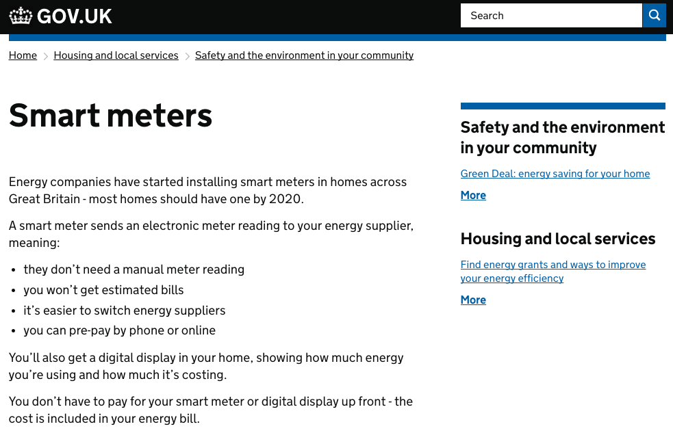
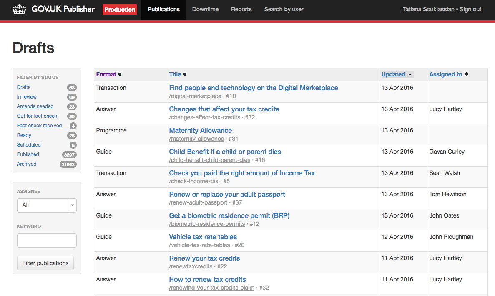

# Publisher

Publisher is the primary content design app for GOV.UK. It provides the user interface for
entering all the key editorial formats and an API so other apps (primarily frontend) can
access that data for display. It is intended to work in partnership with Panopticon which
manages document creation, metadata, slugs, titles, etc. It is sometimes referred to as "mainstream publisher".

##Screenshots




## Live examples
- [Answer](https://www.gov.uk/smart-meters)
- [Business support](https://www.gov.uk/waterborne-freight-grant-wfg-scotland)
- [Campaign](https://www.gov.uk/mystatepension)
- [Completed transaction](https://www.gov.uk/done/make-lpa)
- [Guide](https://www.gov.uk/council-tax-appeals)
- [Help page](https://www.gov.uk/help/accessibility)
- [Licence](https://www.gov.uk/day-nurseries-wales)
- [Local transactions](https://www.gov.uk/complain-about-your-council)
- [Place](https://www.gov.uk/ukonline-centre-internet-access-computer-training)
- [Programme](https://www.gov.uk/home-responsibilities-protection-hrp)
- [Simple smart answer](https://www.gov.uk/qualify-tax-credits)
- [Transaction](https://www.gov.uk/council-tax-bands)
- [Video](https://www.gov.uk/renting-buying-business-premises)

## Nomenclature

- Artefact: a document on GOV.UK. Artefacts shown in publisher were created in the [panopticon](https://github.com/alphagov/panopticon) app.

## Technical documentation

This is a Ruby on Rails application that presents mainstream document formats created in [panopticon](https://github.com/alphagov/panopticon), and makes their information available to the frontend through an API.

###Dependencies

- [panopticon](https://github.com/alphagov/panopticon) - allows to create artefacts/documents listed in publisher. It is being deprecated.
- [imminence](https://github.com/alphagov/imminence) - provides geographical search tools
- [rummager](https://github.com/alphagov/rummager) - handles search
- [content-store](https://github.com/alphagov/content-store) - central storage of published content on GOV.UK
- [govuk_content_api](https://github.com/alphagov/govuk_content_api) - API providing content, metadata and search information to other apps. Being deprecated in favour of content-store.
- [publishing-api](https://github.com/alphagov/publishing-api) - will provide workflow for all content published to GOV.UK - creating a new document, publishing it, etc.
- [router-api](https://github.com/alphagov/router-api) - API for updating routes
- [govuk-content-schemas](http://github.com/alphagov/govuk-content-schemas) - to run the tests
- local transactions data - there is no UI or automated process for importing the source data for local transactions. The source data can be downloaded from [DirectGov](http://local.direct.gov.uk/Data/local_authority_service_details.CSV). It can then be imported using a rake task:

```shell
bundle exec rake local_transactions:import SOURCE=/path/to/local_authority_service_details.CSV
```

- [statsd](https://github.com/etsy/statsd/) - this application uses [statsd-ruby](http://rubygems.org/gems/statsd-ruby) to send metrics to statsd. If a statsd process isn't present on the server it won't matter as statsd-ruby sends metrics over UDP. If a statsd process is present then
it'll send strings with the respective increment/decrement/gauge function to use.
- [asset-manager](https://github.com/alphagov/asset-manager) - manages uploaded assets (images, PDFs, videos etc.). Publisher needs an OAuth bearer token in order to authenticate with Asset Manager. By default, this is loaded from the PUBLISHER_ASSET_MANAGER_BEARER_TOKEN environment variable in config/initializers/gds_api.rb.
To obtain this bearer token, you should create an API user in the signonotron2 application. In the signonotron2 directory, to generate the bearer token you need, run:

```shell
rake api_clients:create[publisher,publisher@example.com,asset-manager,signin]
```
### Running the application

`cd /var/gov/development`
`bowl publisher`

If you're just interested in running the Publisher locally, with a minimum of interaction
with other apps, here's how. This assumes you're using this [development setup](https://github.gds/gds/development).

### Running the test suite

`bundle exec rake`

The test suite relies on the presence of the [govuk-content-schemas](http://github.com/alphagov/govuk-content-schemas)
repository. If should be at the same directory level as the government-frontend repository.

Or to specify the location explicitly:

`GOVUK_CONTENT_SCHEMAS_PATH=/some/dir/govuk-content-schemas bundle exec rake`

## Licence

[MIT License](LICENSE)
